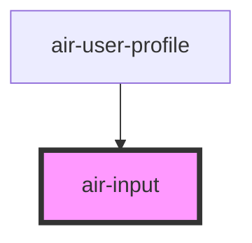

# air-input


<!-- Auto Generated Below -->


## Properties

| Property       | Attribute       | Description | Type                         | Default     |
| -------------- | --------------- | ----------- | ---------------------------- | ----------- |
| `autofocus`    | `autofocus`     |             | `boolean`                    | `false`     |
| `customClass`  | `custom-class`  |             | `string`                     | `''`        |
| `customStyle`  | --              |             | `{ [key: string]: string; }` | `{}`        |
| `disabled`     | `disabled`      |             | `boolean`                    | `false`     |
| `error`        | `error`         |             | `boolean`                    | `false`     |
| `errorMessage` | `error-message` |             | `string`                     | `''`        |
| `label`        | `label`         |             | `string`                     | `undefined` |
| `maxLength`    | `max-length`    |             | `number`                     | `undefined` |
| `minLength`    | `min-length`    |             | `number`                     | `undefined` |
| `name`         | `name`          |             | `string`                     | `undefined` |
| `pattern`      | `pattern`       |             | `string`                     | `undefined` |
| `placeholder`  | `placeholder`   |             | `string`                     | `undefined` |
| `required`     | `required`      |             | `boolean`                    | `false`     |
| `type`         | `type`          |             | `string`                     | `'text'`    |
| `value`        | `value`         |             | `string`                     | `undefined` |


## Dependencies

### Used by
 - [air-user-profile](../feature-components/user-profile)

### Graph


### 1. 普通文本输入框

```jsx live
    <air-input
      label="用户名"
      name="username"
      placeholder="请输入用户名"
    ></air-input>
```

### 2. 密码输入框

```jsx live
    <air-input
      label="密码"
      name="password"
      type="password"
      placeholder="请输入密码"
      error="{true}"
      errorMessage="密码格式不正确"
    ></air-input>

```

### 3. 邮箱输入框

```jsx live
    <air-input
      label="邮箱"
      name="email"
      type="email"
      placeholder="请输入邮箱"
      required="{true}"
      error="{false}"
    ></air-input>

```

### 4. 电话输入框

```jsx live
    <air-input label="电话" name="phone" type="tel" placeholder="请输入电话">
      <span slot="prefix" class="icon-phone">📞</span>
      <span slot="suffix" class="icon-clear">❌</span>
    </air-input>

```

### 5. 带有前后缀图标的输入框

```jsx live
    <air-input
      label="网站地址"
      name="website"
      type="url"
      placeholder="请输入网站地址"
      pattern="https?://.*"
      error="{true}"
      errorMessage="请输入有效的 URL"
    ></air-input>

```

### 6. 带有正则验证的输入框

```jsx live
    <air-input
      label="禁用输入框"
      name="disabled"
      placeholder="不可编辑"
      disabled="{true}"
    ></air-input>

```