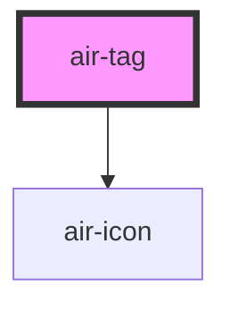

`air-tag` 是一个灵活且美观的标签组件，支持多种颜色、大小、形状和状态，适用于各种场景。

## 用法示例

### 基础用法
<air-previewer size="auto">
<air-tag>默认标签</air-tag>
<air-tag color="blue">信息标签</air-tag>
<air-tag color="green">成功标签</air-tag>
<air-tag color="yellow">警告标签</air-tag>
<air-tag color="red">错误标签</air-tag>
</air-previewer>

### 可关闭标签
<air-previewer size="auto">
<air-tag closable>可关闭标签</air-tag>
<air-tag color="blue" closable>重要信息</air-tag>
<air-tag color="red" closable size="sm">小号错误</air-tag>
</air-previewer>

### 带图标的标签
<air-previewer size="auto">
<air-tag color="green">
  <air-icon name="check"/>
</air-tag>

<air-tag color="blue" size="sm">
  <air-icon name="link"/>
</air-tag>
</air-previewer>

### 自定义形状
<air-previewer size="auto">
<air-tag rounded="none">直角标签</air-tag>
<air-tag rounded="full">圆形标签</air-tag>
<air-tag color="blue" rounded="full">
  <air-icon name="star" size="2xs"/>
</air-tag>
</air-previewer>

## 属性

| 属性       | 描述     | 类型                                               | 默认值   |
| ---------- | -------- | -------------------------------------------------- | -------- |
| `closable` | 是否可关闭 | `boolean`                                          | `false`  |
| `color`    | 标签颜色  | `"blue" \| "gray" \| "green" \| "red" \| "yellow"` | `'gray'` |
| `rounded`  | 标签形状  | `"full" \| "md" \| "none"`                         | `'md'`   |
| `size`     | 标签大小  | `"md" \| "sm"`                                     | `'md'`   |

## 事件

| 事件名称     | 描述       | 类型                |
| ------------ | ---------- | ------------------- |
| `airClose`   | 关闭标签时触发 | `CustomEvent<void>` |

## Shadow Parts

| 部分名称       | 描述       |
| -------------- | ---------- |
| `"close-button"` | 自定义关闭按钮 |

## 依赖关系

### 依赖

- [air-icon](./icon.mdx)

### 依赖图

## 样式

`air-tag` 支持通过 CSS 自定义以下部分样式：

- `close-button`: 自定义关闭按钮的样式。

## 注意事项

- 若使用 `closable` 属性，需要监听 `airClose` 事件以执行标签关闭的逻辑。
- 默认颜色为灰色 (`gray`)，可以通过 `color` 属性自定义颜色。

## 开发者说明

`air-tag` 是使用 [StencilJS](https://stenciljs.com/) 构建的。

