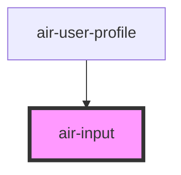

# air-input


<!-- Auto Generated Below -->

## Properties
| Property       | Attribute       | Description | Type                         | Default     |
| -------------- | --------------- | ----------- | ---------------------------- | ----------- |
| `autofocus`    | `autofocus`     |             | `boolean`                    | `false`     |
| `customClass`  | `custom-class`  |             | `string`                     | `''`        |
| `customStyle`  | --              |             | `{ [key: string]: string; }` | `{}`        |
| `disabled`     | `disabled`      |             | `boolean`                    | `false`     |
| `error`        | `error`         |             | `boolean`                    | `false`     |
| `errorMessage` | `error-message` |             | `string`                     | `''`        |
| `label`        | `label`         |             | `string`                     | `undefined` |
| `maxLength`    | `max-length`    |             | `number`                     | `undefined` |
| `minLength`    | `min-length`    |             | `number`                     | `undefined` |
| `name`         | `name`          |             | `string`                     | `undefined` |
| `pattern`      | `pattern`       |             | `string`                     | `undefined` |
| `placeholder`  | `placeholder`   |             | `string`                     | `undefined` |
| `required`     | `required`      |             | `boolean`                    | `false`     |
| `type`         | `type`          |             | `string`                     | `'text'`    |
| `value`        | `value`         |             | `string`                     | `undefined` |

## Dependencies
### Used by
 - [air-user-profile](../feature-components/user-profile)
### Graph

### 1. Regular text input
```jsx live
    <air-input
      label="username"
      name="username"
      placeholder="Please enter your username"
    ></air-input>
```
```
### 2. Password input
```jsx live
    <air-input
      label='Password'
      name='password'
      type='password'
      placeholder='Please enter your password'
      error='{true}'
      errorMessage='The password format is incorrect'
    ></air-input>
```
### 3. Email input box
```jsx live
        <air-input
      label="email"
      name="email"
      type="email"
      placeholder="Please enter your email"
      required="{true}"
      error="{false}"
    ></air-input>
```
### 4. Phone input field
```jsx live
        <air-input label="电话" name="phone" type="tel" placeholder="请输入电话">
      <span slot="prefix" class="icon-phone">📞</span>
      <span slot="suffix" class="icon-clear">❌</span>
    </air-input>
```
### 5. Input field with prefix and suffix icons
```jsx live
    <air-input
      label='Website address'
      name='website'
      type='url'
      placeholder='Please enter the website address'
      pattern='https?://.*'
      error='{true}'
      errorMessage='Please enter a valid URL'
    ></air-input>
```
### 6. Input field with regular expression validation
```jsx live
        <air-input
      label="Disable input field"
      name="disabled"
      placeholder="Not editable"
      disabled="{true}"
    ></air-input>

```