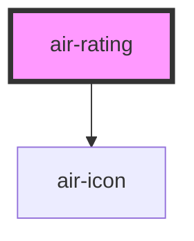

`air-rating` 组件是一个评分组件，允许用户通过点击星级来进行评分。支持自定义样式、图标、最大评分等级等属性，并通过事件向外传递评分变化。

## 属性 (Properties)

| 属性名        | 属性       | 描述                                   | 类型                                                                 | 默认值              |
| ------------- | ----------- | -------------------------------------- | -------------------------------------------------------------------- | ------------------- |
| `customStyle` | --          | 自定义样式（CSS键值对对象）             | `{ [key: string]: string; }`                                         | `{}`                |
| `emptyIcon`   | `empty-icon`| 未选中图标                             | `string`                                                             | `'star-outline'`     |
| `filledIcon`  | `filled-icon`| 选中图标（直接使用air-icon的name）    | `string`                                                             | `'star'`             |
| `iconSet`     | `icon-set`  | 图标集类型                             | `"bx" \| "bxs" \| "fas" \| "iconfont" \| "iconpark" \| "material-icons"` | `'material-icons'`  |
| `level`       | `level`     | 当前评分等级 (0 ~ max)                | `number`                                                             | `0`                  |
| `max`         | `max`       | 最大星数（1 ~ 10）                     | `number`                                                             | `5`                  |

### 说明：
- **`customStyle`**：接收一个对象，允许用户设置自定义样式。对象中的每个键值对表示一个CSS样式属性和它的值。
- **`emptyIcon`**：指定未选中时显示的图标，默认使用 `'star-outline'`。
- **`filledIcon`**：指定选中时显示的图标，默认使用 `'star'`。
- **`iconSet`**：选择图标的样式集合。可选值包括：
  - `'material-icons'`：Google Material Icons。
  - `'fas'`：Font Awesome Solid Icons。
  - `'bx'`、`'bxs'`：BoxIcons。
  - `'iconfont'`：自定义图标字体。
  - `'iconpark'`：IconPark Icons。
- **`level`**：当前评分，取值范围为 `0` 到 `max`。
- **`max`**：设置评分的最大星数，范围为 `1` 到 `10`。

## 事件 (Events)

| 事件名       | 描述               | 类型                    |
| ------------ | ------------------ | ----------------------- |
| `ratingChange` | 评分变化事件        | `CustomEvent<number>`   |

### 说明：
- **`ratingChange`**：当评分等级发生变化时，触发该事件。事件携带当前评分值，类型为 `number`。

## 依赖 (Dependencies)

### 依赖的组件

- **`air-icon`**：用于显示评分图标。

### 组件关系图

## 示例
### 基本用法

<air-previewer size="auto">
<air-rating
  icon-set="material-icons"
  filled-icon="star"
  empty-icon="star_border"
  level="3"
  max="5"
  customStyle="{ 'background-color': 'lightgray', 'padding': '10px' }">
</air-rating>
</air-previewer>

### 点击评分
<air-previewer size="auto">
<air-rating
  icon-set="fas"
  filled-icon="fa-star"
  empty-icon="fa-star-o"
  level="4"
  max="5"
  customStyle="{ 'color': 'gold' }">
</air-rating>
</air-previewer>

### 事件监听
<air-previewer size="auto">
<air-rating size="auto"
  icon-set="bx"
  filled-icon="bxs-star"
  empty-icon="bxs-star-outline"
  level="2"
  max="5"
  customStyle="{ 'margin': '20px' }"
  onratingChange="handleRatingChange"></air-rating>
</air-previewer>